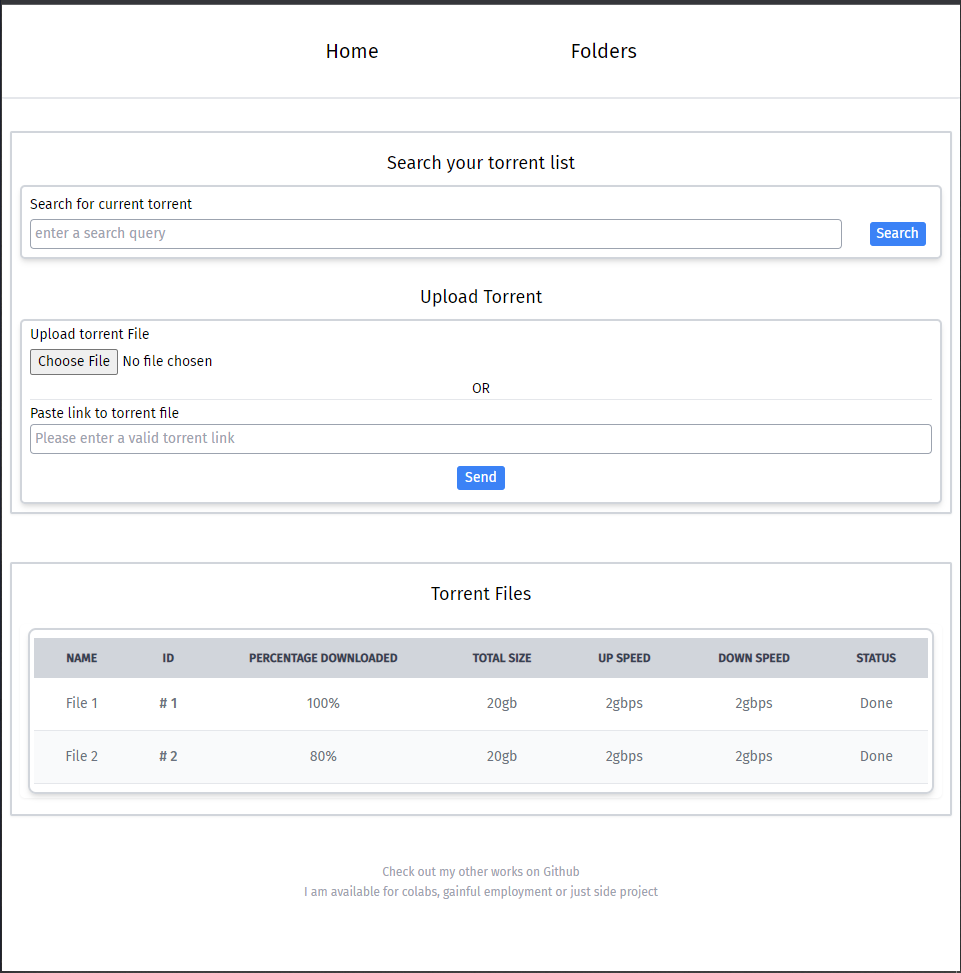
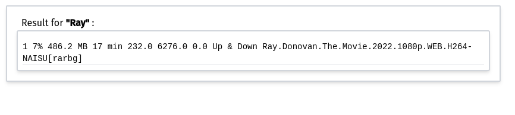
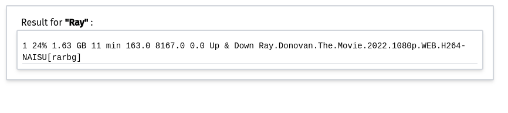
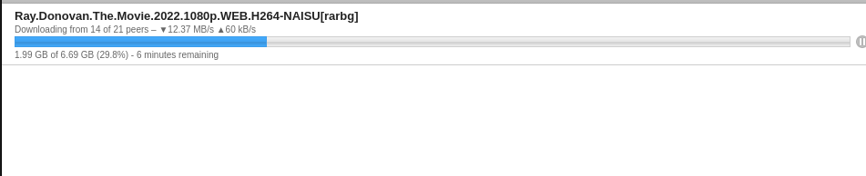
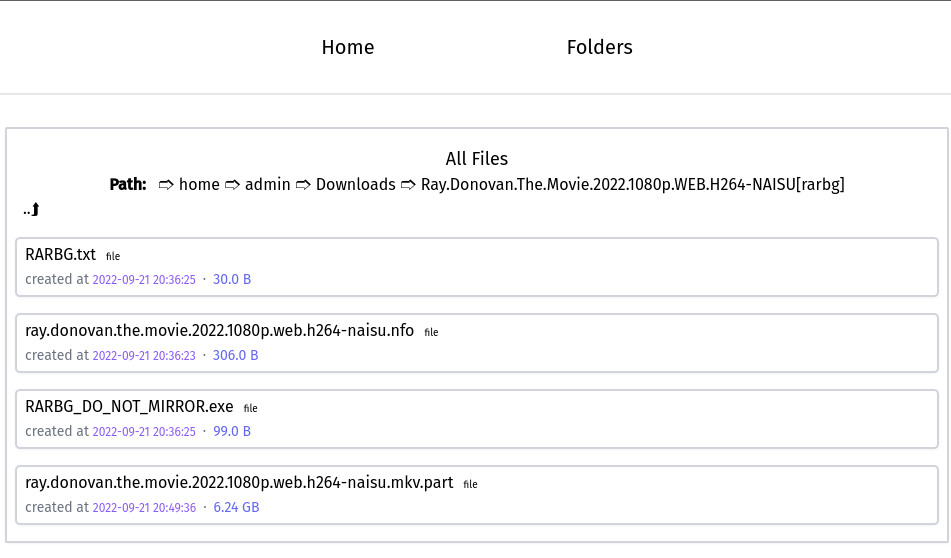
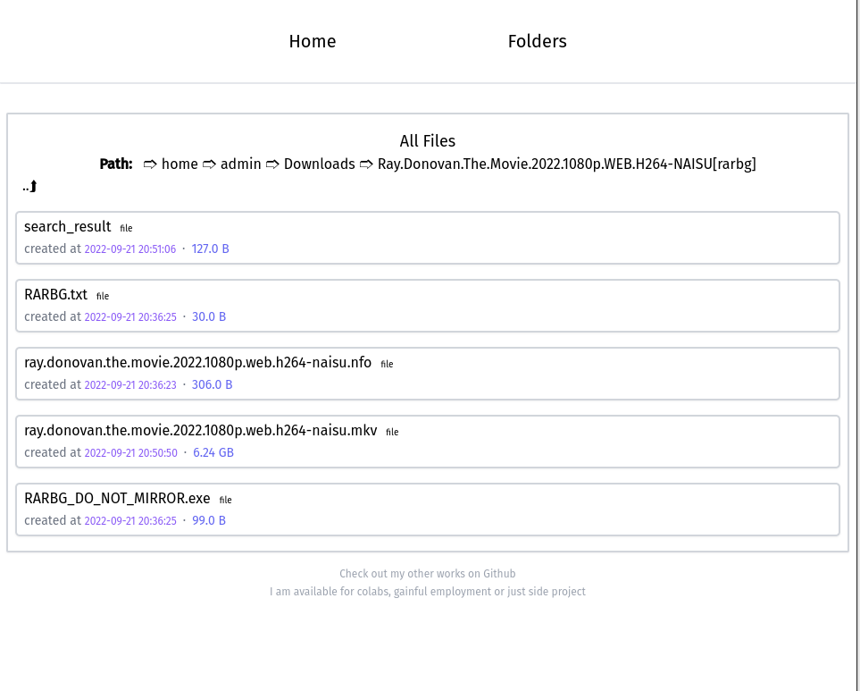
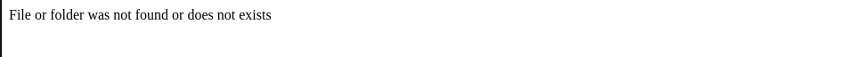

# transmission-seedbox
This README is incomplete

This assumes that you already have transmission installed and setup already

The Folder view sometimes returns an error ([see here](#if-you-get-this-error-message)), simply add a "/" to the end of url in the address bar

...


## Making gunicorn run as a daemon
- To run gunicorn as a daemon, you need to create a service file in `/etc/systemd/system`
``` bash
sudo nano /etc/systemd/system/transmission-ui.service
```
- Next, copy and paste the following details to the current nano editor

> **Note:** Replace all the text in *angled brackets < >* with your own information

```bash
[Unit]
Description=Gunicorn server for <myseedboxname or NameOfYourChoice>

[Service]
User=<root or your username>
WorkingDirectory=<pathToYourSeedboxDirector>
ExecStart=/bin/bash -c 'cd <projectDirectory> && source <venvDir>/bin/activate && gunicorn wsgi:app'
Restart=always


[Install]
WantedBy=multi-user.target
```
### Start service
- reload the service file to include the new service

```bash
sudo systemctl daemon-reload
```

- start the service
```bash
sudo systemctl start <NameOfServiceYouJustCreated>.service
```

- check the status of your new service
```bash
sudo systemctl status <NameOfServiceYouJustCreated>.service
```

- to enable your service on every reboot
```bash
sudo systemctl enable <NameOfServiceYouJustCreated>.service
```

- to disable your service on every reboot
```bash
sudo systemctl disable <NameOfServiceYouJustCreated>.service
```
<hr>

### You can also use the copy of transmission-ui.service in the repo and edit accordingly
```
User=<your username>
WorkingDirectory=<path to seedbox>
# eg /home/johndoe/transmission-seedbox

ExecStart=/bin/bash -c 'cd <path to seedbox> && source bin/activate && gunicorn wsgi:app'
# eg 'cd /home/johndoe/transmission-seedbox && source bin/activate && gunicorn wsgi:app'

Restart=always

[Install]
WantedBy=multi-user.target
```
After editing, copy to `/etc/systemd/system`
``` bash
sudo cp ./transmission-ui.serivice /etc/systemd/system
```
> **Note:** Make sure you are copying from the your local repo directory<br>

As usual, after copying you need to reload reload the service. just follow the same procedure as [before](#start-service) 👈

<br>

## Some images in/out of context 🤷‍♂️


### After adding torrent 


### 30s later


### Progress also from transmission-web 


### File Browser (during donwload)


### File Browser (After donwload is complete)


<br>

> ### If you get this error message: 
> simply add a "/" to the end of the path.

<br>
Video fix

[](assets/video-h265.mp4 "Sample Video")
